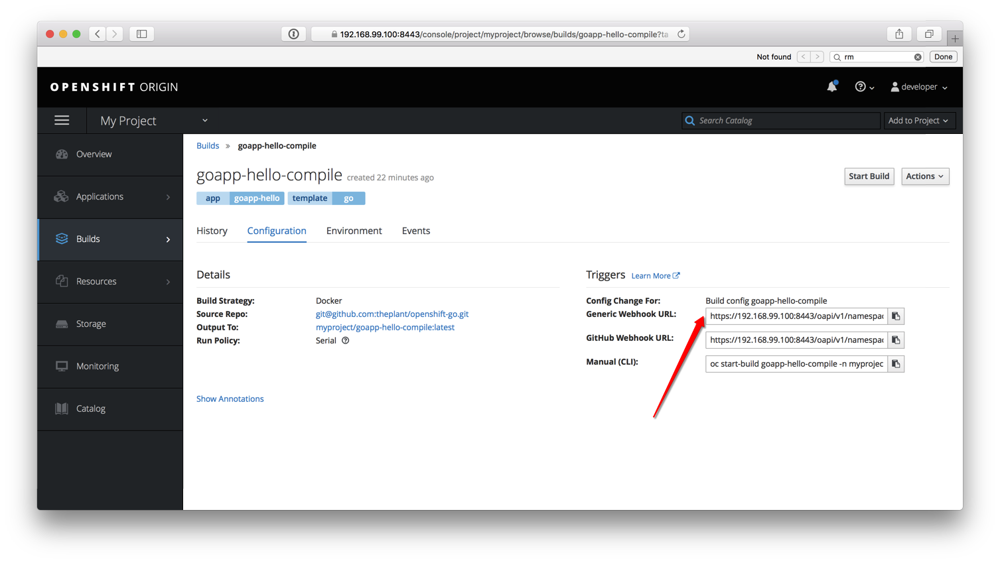

## Add Go to OpenShift catalog

Apply `go.yaml` template to your OpenShift cluster, Then you will have Go in your catalog.

```
oc apply -f go.yaml -n openshift
```

It should looks like this:


## Create Docker Registry Secret

```bash
$ oc create secret docker-registry my-docker-registry --docker-server=registry.theplant-dev.com --docker-username=sunfmin --docker-email=sunfmin@gmail.com --docker-password=<password>
```

## Create Source Clone Secret

```bash
$ oc -n myproject create secret generic my-github-clone-secret --from-file=ssh-privatekey=<path/to/ssh/private/key> --type=kubernetes.io/ssh-auth
```

## Create Config Map

By command line

```bash
$ oc create configmap <name> --from-env-file=<path/to/bar.env> -n myproject
```

Later when the env variables needs to change, you can do this to update them:

```bash
$ oc delete configmap <name> -n myproject
$ oc create configmap <name> --from-env-file=<path/to/bar.env> -n myproject
```

## Create New App

Click the Go icon that created by us before, you will see:


And fill in the secrets and config maps created above. then you will be able to deploy your first app


## Three Stage Build: Dep, Build, Runtime

And for many type of apps, I think manage a dependency container image is a good idea to increase the speed of your build time. Developers manually build the dependency image and push it to a registry, and Docker will cache that image in it's docker and reuse them every time without have to fetch dependencies. See [Dep.Dockerfile](./app1/Dep.Dockerfile) for example

This OpenShift template contains two BuildConfig

Build stage called `{name}-compile` BuildConfig which will git clone your source code, and run your `Build.Dockerfile` to build the binary and other assets that you want include in `/app/` folder. Also must copy runtime stage `Dockerfile` to path `/Dockerfile` for runtime docker image to be built.

Runtime stage use the `/Dockerfile` to build a very small base image like alpine and the files in `/app/` to it, It will normally will execute `/app/entry` as docker cmd which was written by developer inside `/Dockerfile`.


## Trigger OpenShift to build and deploy after tests on CI passed

We can integrate OpenShift with Semaphore CI with it's general trigger on BuildConfig, navigate OpenShift Console to the BuildConfig for `{name}-compile`:



Copy that value, and put this curl to call it into your Semaphore CI build after test succeed.

```bash
curl -k -X POST -H "Content-Type: application/json" https://192.168.99.100:8443/oapi/v1/namespaces/myproject/buildconfigs/goapp-hello-compile/webhooks/fluuRF2rFY5RcIBeipj3/generic
```

## Workflows

### Development Workflow

- Developer create github repository with Build.Dockerfile and Dockerfile
- Developer create Semaphore CI test environment to run CI, Without Building Docker image
- Developer create new app in OpenShift use OpenShift Web Console
- SA create stateful resources like RDS, Redis, Elasticsearch etc, and give developer access point and credentials
- Developer manage a Config Map for all env variables of a app
- After Semaphore CI succeed, It notify OpenShift pull source code, use Build.Dockerfile, Dockerfile to build image, deploy the new image, expose a url for Developer/QA to test the app
- Developer/QA tests

The benefit of this workflow is that Developer can create/add any app they want without writing any shell scripts or QA involved. they can for example create a new user testable for their own testing branch.

### Production Workflow

Production deployed docker images need to be tagged with version numbers like 1.0.1, and each version number should attach a changelog to describe changes for track-ability.

- Developer use script to pull image built by development OpenShift, tag it with version numbers, and push it to registry.theplant-dev.com
- Developer might update production config maps use `kubectl delete configmap myapp && kubectl create configmap myapp --from-env-file=myapp.env`
- Developer use `kubectl set image deployment/myapp myapp=myapp:1.91` to deploy production

Think about a way to automate this

