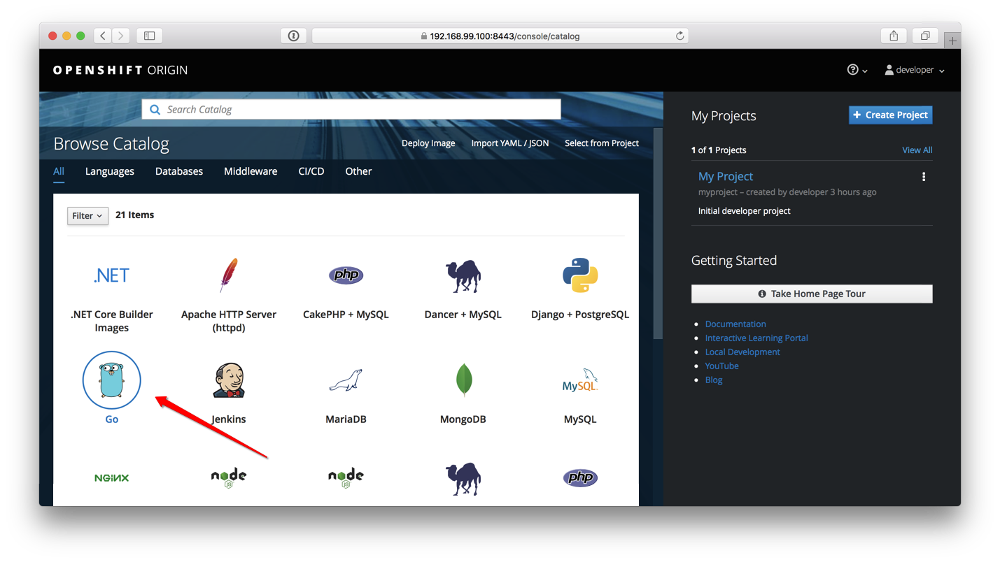
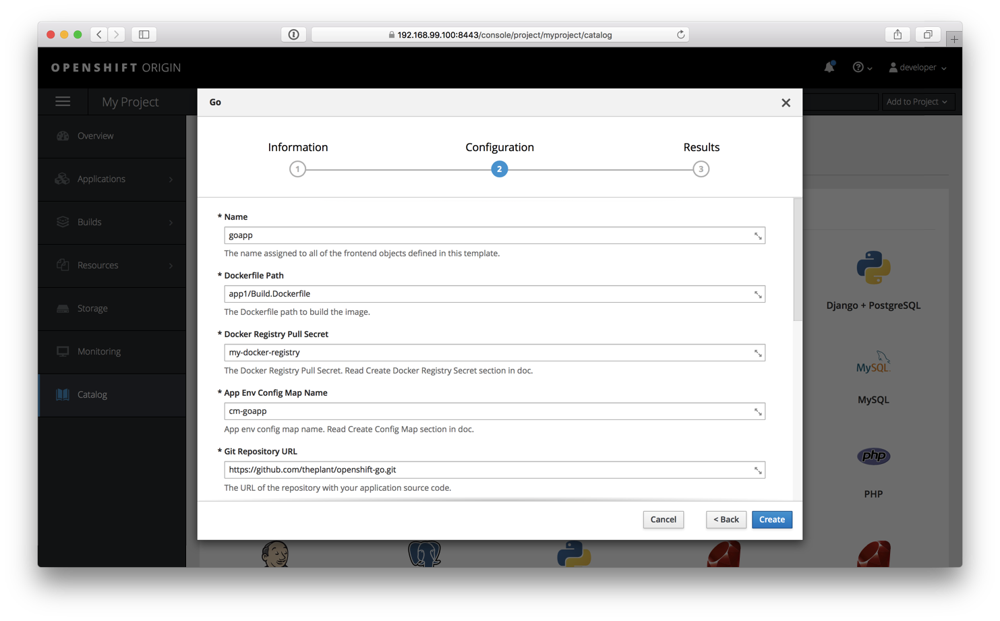

## Add Go to OpenShift catalog

Apply `go.yaml` template to your OpenShift cluster, Then you will have Go in your catalog.

```
oc apply -f go.yaml -n openshift
```

It should looks like this:




## Create Docker Registry Secret

```bash
$ oc create secret docker-registry my-docker-registry --docker-server=<server> --docker-username=<username> --docker-password=<password> --docker-email=<email>
```

## Create Source Clone Secret

```bash
$ oc -n myproject create secret generic my-github-clone-secret --from-file=ssh-privatekey=<path/to/ssh/private/key> --type=kubernetes.io/ssh-auth
```

## Create Config Map

By command line

```bash
$ oc create configmap <name> --from-env-file=<path/to/bar.env>
```

## Create New App

Click the Go icon that created by us before, you will see:



And fill in the secrets and config maps created above. then you will be able to deploy your first app


## How you should write your Build.Dockerfile

For OpenShift be able to build your Go app correctly, You have to provide a Build.Dockerfile in your source repository. See [Build.Dockerfile](./app1/Build.Dockerfile) for example.

And for many type of apps, I think manage a dependency container image is a good idea to increase the speed of your build time. Because you manually build the dependency image and push it to registry, and OpenShift will cache that image in it's docker and reused them every time without have to fetch dependencies. See [Dep.Dockerfile](./app1/Dep.Dockerfile) for example
